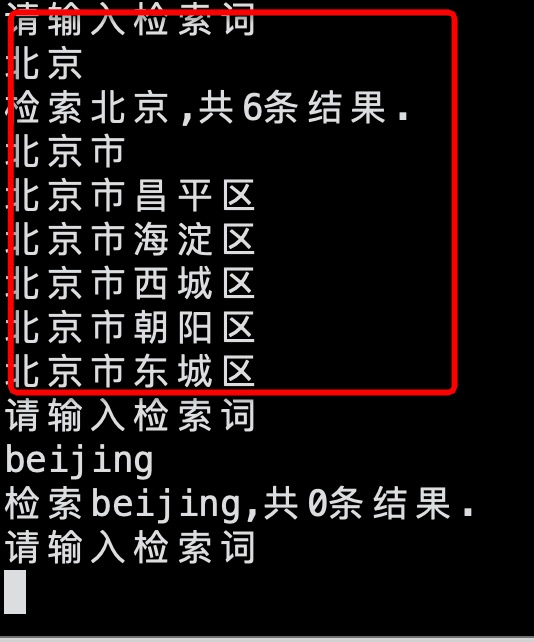

## 项目目录
	bin		存储二进制文件
	library	trie树的定义和方法
	build	编译相关
	data	测试语料
	build.sh	编译脚本
	start.sh	启动脚本
	main.cpp	main文件

## 环境
	gcc/clang 要求支持c++11
	cmake3.15以上版本	
	linux或mac环境
	
## 算法原理
	基于trie树实现的前缀索引，多用于搜索建议

# 效果展示

